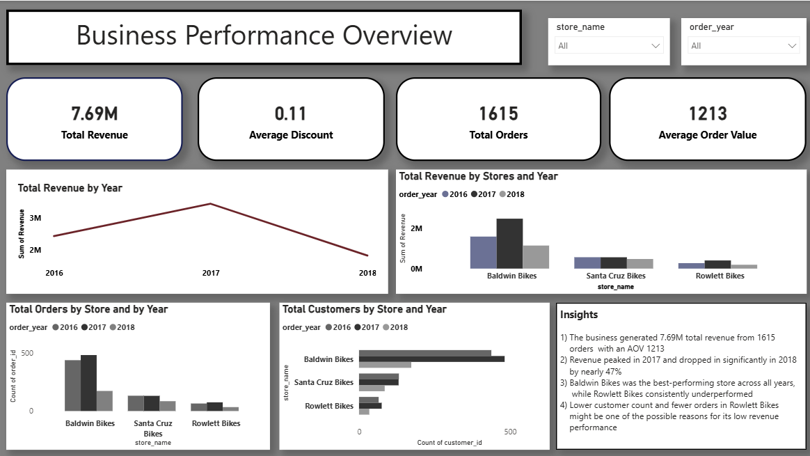
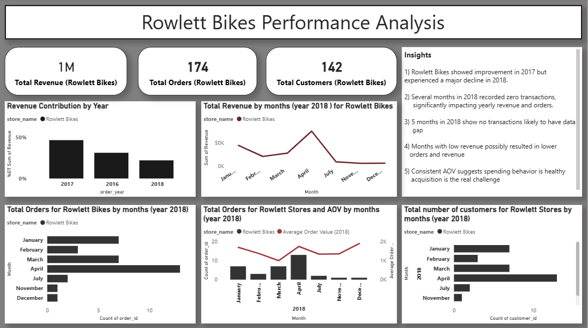
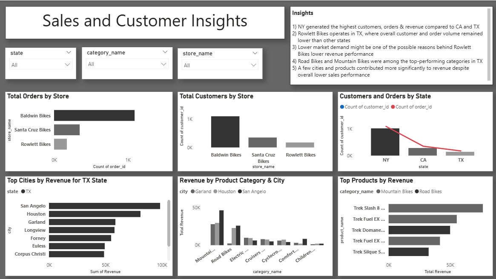
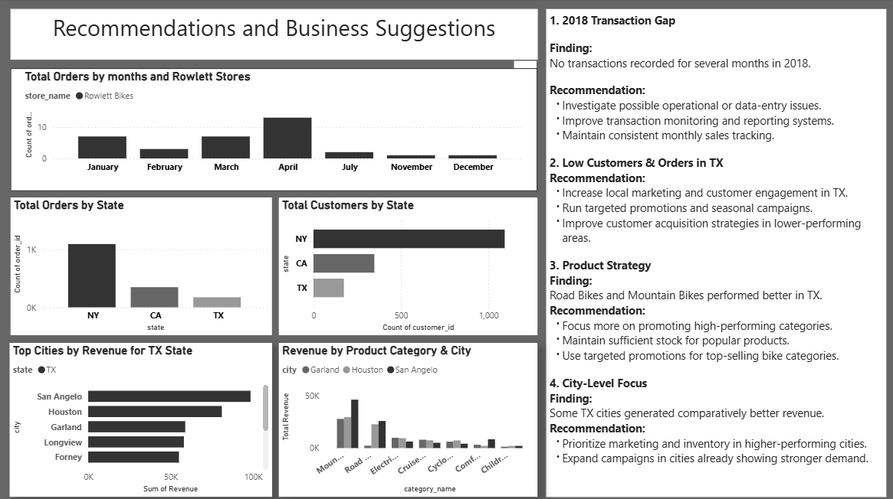

# bike-store-sales-analysis
Excel and Power BI project analyzing bike store sales performance across multiple states.
# Bike Store Sales Performance Analysis

## Project Overview
This project analyzes the sales performance of three bike stores using SQL and Power BI. The analysis focuses on identifying trends, comparing store performance, and understanding possible reasons behind the underperformance of Rowlett Bikes.

---

## Tools Used
- Power BI
- DAX
- Excel

---

## Key Insights
- Baldwin Bikes generated the highest revenue across all years.
- Rowlett Bikes consistently underperformed in terms of revenue, orders, and customers.
- A major revenue decline was observed in 2018.
- Several months in 2018 recorded no transactions for Rowlett Bikes.
- Mountain Bikes and Road Bikes showed strong performance in 2017, while Electric Bikes performed better in 2018.

---

## Dashboard Screenshots

### Overview Dashboard


### Rowlett Bikes Performance Analysis


### Sales & Customer Insights


### Recommendations Dashboard


---

## Recommendations
- Improve transaction tracking systems.
- Increase customer engagement in TX.
- Promote high-performing product categories.
- Focus marketing efforts on higher-performing cities.

---

## Files Included
- Power BI Dashboard (.pbix)
- Project Report (.txt)
- Dataset
- Dashboard Screenshots

## Project Structure

```text
bike-store-sales-analysis/
│
├── dashboard/
│   └── bike_store_sales_analysis.pbix
│
├── data/
│   ├── brands.csv
│   ├── categories.csv
│   ├── customers.csv
│   ├── orders.csv
│   ├── order_items.csv
│   ├── products.csv
│   ├── staffs.csv
│   ├── stocks.csv
│   └── stores.csv
│
├── images/
│   ├── overview_dashboard.png
│   ├── rowlett_analysis.png
│   ├── sales_customer_insights.png
│   └── recommendations.png
│
├── report/
│   └── bike_store_analysis_report.docx
│
└── README.md
```

    ## Project Files

- [Download Power BI Dashboard](dashboard/Bike dataset dashboard.pbix)

- [Download Raw Dataset](data/bike_store_raw_data.xlsx)

- [Download Project Report](Bike Store Sales Performance Analysis.pdf)
